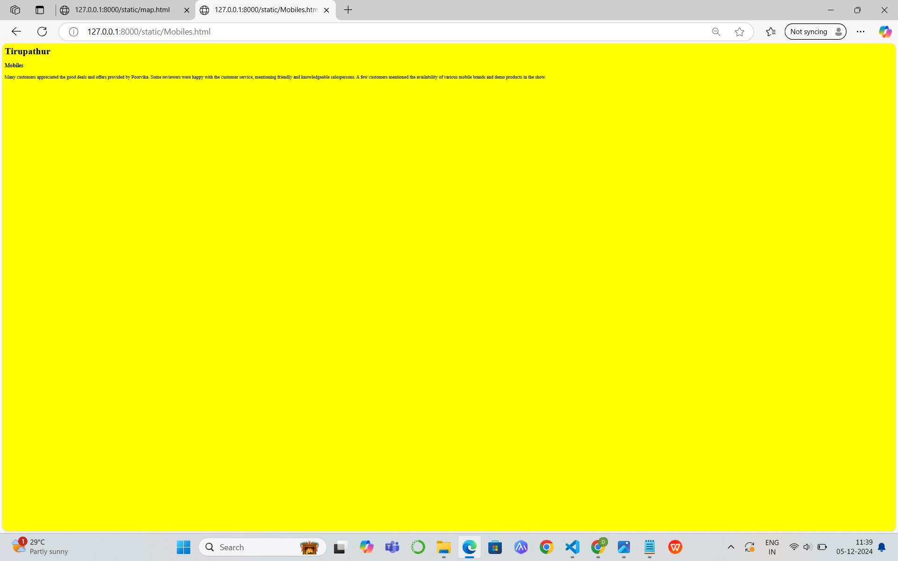

# Ex04 Places Around Me
## Date:05.12.2024

## AIM
To develop a website to display details about the places around my house.

## DESIGN STEPS

### STEP 1
Create a Django admin interface.

### STEP 2
Download your city map from Google.

### STEP 3
Using ```<map>``` tag name the map.

### STEP 4
Create clickable regions in the image using ```<area>``` tag.

### STEP 5
Write HTML programs for all the regions identified.

### STEP 6
Execute the programs and publish them.

## CODE

```

map.html

<html>
    <body>
        <h1>Tirupathur</h1>
        <h3>D.Devika(24002534) </h3>
        
        <map name="image-map">
        <area target="" alt="Tirupathur" title="Tirupathur" href="Tirupathur" coords="755,634,916,695" shape="rect">
        <area target="" alt="Hotel" title="Hotel" href="Hotel" coords="462,758,761,768,739,824,444,819,462,758" shape="poly">
        <area target="" alt="College" title="College" href="College" coords="762,500,111" shape="circle">
        <area target="" alt="Mobiles" title="Mobiles" href="Mobiles" coords="841,579,1036,628" shape="rect">
        <area target="" alt="Theatre" title="Theatre" href="Theatre" coords="622,659,104" shape="circle">
        </map>
    </body>
</html>

Tirupathur.html

<html>
    <body bgcolor="red">
        <h1>Tirupathur</h1>
        <h3>Tirupathur</h3>
<p>
    Tirupathur district is a district of Tamil Nadu, India, formed by trifuricating the Vellore district. The Government of Tamil Nadu has announced its proposal on August 15, 2019, together with Ranipet district. However it was officially declared on November 28, 2019 by Chief Minister. The town of Tirupathur would serve as the district headquarters.
</p>
    </body>
</html>

Hotel.html

<html>
    <body bgcolor="pink">
        <h1>Tirupathur</h1>
        <h3>Hotel</h3>
<p>
    Close to Tirupattur Railway Station, this contemporary property offers comfort with its stylish rooms, a restaurant, a banquet hall and upscale amenities.One of the best hotels in Town. Located on the Krishnagiri Road of Tirupattur. Lavish Rooms with Buffet Breakfast with Wide Menu. Enjoyed food thrice.
</p>
    </body>
</html>

College.html

<html>
    <body bgcolor="blue">
        <h1>Tirupathur</h1>
        <h3>College</h3>
<p>
    Sacred Heart College is an affiliated First Grade College of Thiruvalluvar University.It is a minority institution, established and administered by the Salesians of Don Bosco(SDB).The first care of the management is to give Higher Education to the Catholic youth in a Christian atmosphere of peace, justice and social responsibility with a preferential option for the poor among them. The College is also open to students of all castes and creeds other than Catholics. Their religious beliefs are respected in this institution
</p>
    </body>
</html>

Mobiles.html

<html>
    <body bgcolor="yellow">
        <h1>Tirupathur</h1>
        <h3>Mobiles</h3>
<p>
    Many customers appreciated the good deals and offers provided by Poorvika.
    Some reviewers were happy with the customer service, mentioning friendly and knowledgeable salespersons.
    A few customers mentioned the availability of various mobile brands and demo products in the show.
</p>
    </body>
</html>

Theatre.html

<html>
    <body bgcolor="green">
        <h1>Tirupathur</h1>
        <h3>Theatre</h3>
<p>
    Sri Ramajeyam Theatre A/C 4K, Achamangalam, Tirupattur. Mark as favourite cinema. No.2, Thiru. Vika Road, Achamangalam, Tirupattur, TamilNadu 635601, India
</p>
    </body>
</html>

```

## OUTPUT





## RESULT
The program for implementing image maps using HTML is executed successfully.
